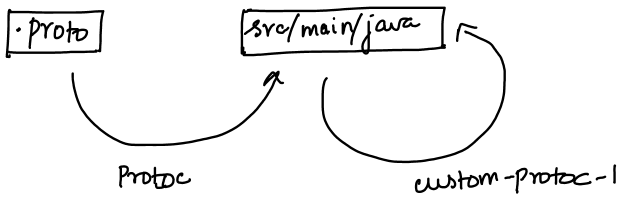
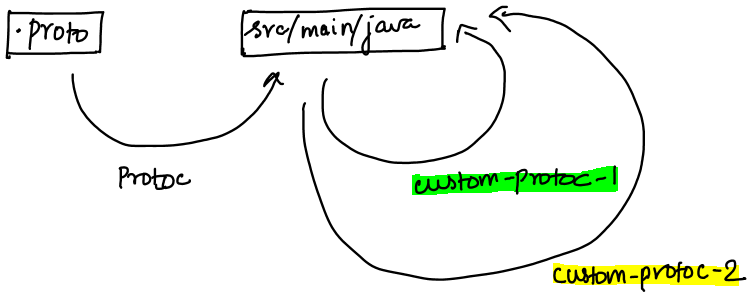

# Custom protoc plugin
Only primitive types are supported in protocol buffers. protoc can compile a `string` type in protocol buffer to `java.lang.String` and also to python String.  
But if you were to add support for, say, LocalDate, protoc should be able to represent this type in all the supported language. 
Customizing protoc codegen opens the door to represent a proto message in whatever type you want in the language you want. 
In this project, I will demonstrate the use of custom protoc plugin in Java language.

# How can you customize protoc's codegen?
Via [insertion points](https://developers.google.com/protocol-buffers/docs/reference/cpp/google.protobuf.compiler.plugin.pb) 

- interface_extends
- message_implements
- builder_implements
- builder_scope
- class_scope
- outer_class_scope

This is how the auto generated proto class looks like. The insertion points are self-explanatory if you follow it with this example.

```
public final class GreetingProto {
    public interface GreetingOrBuilder extends
      // @@protoc_insertion_point(interface_extends:com.foo.Greeting)
      com.google.protobuf.MessageOrBuilder {
      
    }

    public static final class Greeting extends
        com.google.protobuf.GeneratedMessageV3 implements
        // @@protoc_insertion_point(message_implements:com.foo.Greeting)
        GreetingOrBuilder {
                  public static final class Builder extends
                        com.google.protobuf.GeneratedMessageV3.Builder<Builder> implements
                        // @@protoc_insertion_point(builder_implements:com.foo.Greeting)
                        com.foo.javaPackage.Greeting.GreetingOrBuilder {
    
                        // @@protoc_insertion_point(builder_scope:com.foo.Greeting)
                  }
        // @@protoc_insertion_point(class_scope:com.foo.Greeting)
    }
  
    // @@protoc_insertion_point(outer_class_scope)
}
```

This insertion point is how we are able to add custom code to the already generated code.
Say I want to add a static method to the above outerClass that just prints default greeting.

```
customCode = "
            public static String defaultGreeting() {
                 return "Hello";
            }"
outerClassScope = "// @@protoc_insertion_point(outer_class_scope)"
autoGeneratedCode.replace(outerClassScope, customCode+outerClassScope)
```



Note that the protoc retains the insertion points so that you can chain any number of protoc plugins.
  


# Applications 
- Exposing custom accessors to the fields in proto message using class scope insertion point. 

  Eg: We can expose a `getBigDecimalOriginalPrice()` for the `price` field in this `TestOrderPrice` message. 
    ```
    message TestOrderPrice {
        string price = 1 [(.foo.java_accessor).big_decimal_accessor = "getBigDecimalOriginalPrice"];
    }
    ```

    Note that the accessor mirrors the original string field here. With these accessors, you are not changing the serialized data - only representing it differently. Since protos are immutable, the original and mirror fields are consistent with each other.
    ```
    public  static final class TestOrderPrice extends
      com.google.protobuf.GeneratedMessageV3 implements
      // @@protoc_insertion_point(message_implements:com.foo.protoPackage.TestOrderPrice)
      TestOrderPriceOrBuilder {
    
        //**********************************AUTO_GENERATED************************
        private java.math.BigDecimal tdPrice_ = null;
        public @javax.annotation.Nullable java.math.BigDecimal getBigDecimalOriginalPrice() {
            if (this.tdPrice_ == null && getPrice() != null && !getPrice().equals("")) {
                this.tdPrice_ = new java.math.BigDecimal(getPrice());
            }
            return this.tdPrice_;
        }
            
        public boolean hasBigDecimalOriginalPrice() {
            return getPrice() != null && !getPrice().equals("");
        }
        //******************************END AUTO_GENERATED************************
        // @@protoc_insertion_point(class_scope:com.foo.protoPackage.TestOrderPrice)
    ```

- Similarly, you can also expose setters via builder scope insertion point. Once again, notice that it is setting the original field.

    ```
    public static final class Builder extends
        com.google.protobuf.GeneratedMessageV3.Builder<Builder> implements
        // @@protoc_insertion_point(builder_implements:com.foo.protoPackage.TestPizzaOrder)
        com.foo.protoPackage.ManyMessagesWithProtoPackage.TestPizzaOrderOrBuilder {
    
        //**********************************AUTO_GENERATED************************
        public Builder setBigDecimalOriginalPrice(@javax.annotation.Nonnull java.math.BigDecimal value) {
            if(value != null) {
              return setPrice(value.toString());
            }
            return setPrice("");
        }
        //******************************END AUTO_GENERATED************************
        // @@protoc_insertion_point(builder_scope:com.foo.protoPackage.TestOrderPrice)
    }
    ```
    You need to use this with caution here. for the same field, there are now two setters - setBigDecimalOriginalPrice() and setPrice(). If both are used, only the latest wins.
    Also, bringing in a type that is not inherent to protos might cause compatibility issues. You are definitely going to use some language-specific-conversion strategy into your project to use these protos - but now those are part of the proto library itself. You need to be aware of the implications if you choose to share this custom-library to the users of your protos.

- You can also make protos implement an interface! We got insertion points for that as well. I have detailed few examples in the project. But, just because you can, does not mean you have to do. As always, use it with caution. 
In my example, I have used [`KafkaEvent`](/proto-lib/src/main/java/com/foo/KafkaEvent.java) interface which forces each proto to denote which field to use as `eventTime` - in Kafka world, say this is the producer timestamp.  

    Check out [annotations](/proto-lib/src/main/proto/annotations/foo_options.proto) and how these are implemented in the protos at [click_event.proto](custom-proto-lib/src/main/proto/click_event.proto)

# Commands
To enable custom protoc support in gradle, first, try to understand how the protoc commands work. Once you do, it is easy to understand what the gradle plugin does.

## Without the plugin 

 - proto-path - directory which has the proto files used in the `import` statements in the proto files that you are going to compile
 - java_out - directory to write the java code-gen
 - followed by proto files - the proto files that are to be compiled
 
 ```
    /home/vinodhini/IdeaProjects/custom-protoc > protoc --proto_path=src/main/proto/ --java_out=src/main/java/ \
    src/main/proto/annotations/foo_options.proto src/main/proto/many* src/main/proto/multiple* src/main/proto/simple_hello_world.proto src/main/proto/single* 
 ```

## With the custom plugin 

Run `./gradlew installDist`. This will make sure the executable is installed at `custom-protoc-plugin/build/install/custom-protoc/bin/custom-protoc-plugin`

Exactly same as the above command - except for the `plugin` and `out` options. protoc converts the proto files and writes to the `java_out` as usual.
It then reads these .java files from `java_out` and passes to the custom plugin you wrote at [custom-protoc-plugin](custom-protoc-plugin/) which is packaged as executable using gradle `application` plugin.
The command interprets the plugin name as `custom` since you have given `--plugin=protoc-gen-custom`. If you want this plugin to be called, say, `batman` you would have to pass `--plugin=protoc-gen-batman` and also the `out` directory
for this plugin as `--batman_out`. This out directory will have the custom codegen applied on top of the protoc's Java codegen. Like this, you can keep chaining any number of plugins you want. 

```
    /home/vinodhini/IdeaProjects/custom-protoc > protoc --proto_path=src/main/proto/ --java_out=src/main/java/ \
    --plugin=protoc-gen-custom=custom-protoc-plugin/build/install/custom-protoc/bin/custom-protoc-plugin  \
    --custom_out=src/main/java \
    src/main/proto/annotations/foo_options.proto src/main/proto/many* src/main/proto/multiple* src/main/proto/simple_hello_world.proto src/main/proto/single*
```

## Structure of the modules 

Before we dive into the gradle plugin, this is how the modules are aligned : 
- [proto-lib](/proto-lib) : has the meta-protos (annotations and custom types)
- [custom-protoc-plugin](/custom-protoc-plugin) : module that has logic to add custom code to the code-gen. This depends on `proto-lib` for processing the annotations
- [custom-protoc-lib](/custom-proto-lib) : this module uses `custom-protoc-plugin` to compile the protos defined in itself.

You can choose to put all the .proto files in `proto-lib` and have `custom-protoc-lib` module only have tests on, say the custom accessors in my example. 
You would only be exposing this `custom-protoc-lib` to other modules/projects since this has the project specific auto-generated code on top of the protoc's java codegen.

Have a look at all various scenarios of proto definitions [here](custom-proto-lib/src/test/proto/) :
 - With/without outerclass (denoted by the option `java_outer_classname`)
 - Single proto file having multiple messages within (denoted by the option `java_multiple_files`)
 - Proto message with same name as the file name

Test cases for the same can be found at :
- [Getter methods](custom-proto-lib/src/test/java/com/foo/codegen/AccessorTest.java)
- [Setter methods](custom-proto-lib/src/test/java/com/foo/codegen/SetterTest.java)
- [Extension functions](custom-proto-lib/src/test/java/com/foo/codegen/ExtenderTest.java)
- [Interfaces](custom-proto-lib/src/test/java/com/foo/codegen/ImplementorTest.java)

## Gradle plugin 
Now if you compare the protobuf gradle plugin at [proto-lib](/proto-lib/proto-lib.gradle) and the one at [custom-proto-lib](custom-proto-lib/custom-proto-lib.gradle), you would be able to relate.

Note that, in gradle file if you use `implementation`/`compile` on the `proto-lib`, it means that you want the proto files to be used as `proto-path` in the command above.

```
A.gradle
    implementation project(':proto-lib') // use the .proto files in the proto-lib module as proto-path to resolve the import statements present in .proto files of module A 
```

And, if you use `protobuf` then it means you want the .proto files in the `proto-lib` module to be compiled and added to classpath of module A. 

```
A.gradle
    project(path: ':proto-lib', configuration: 'protofiles')
```

I have exposed a configuration called protofiles at [proto-lib's gradle](/proto-lib/proto-lib.gradle) which restricts the list to only the .proto files present in `src/main/proto`
If you do not do this, all the protos imported by `proto-lib` module would also be compiled (for eg : say `proto-lib` module has a dependency on google's protobuf or say any other module with .proto files in it. I am excluding those by only focusing on the proto files that are relevant to my project)

# References
Protocol buffers documentation does not have much details. These are the references that helped me decode the use of custom options and codegen in protocol buffers :
1. https://stackoverflow.com/questions/50806894/how-can-i-add-my-own-code-to-java-generated-classes-from-proto-file/58044855#58044855
1. https://expobrain.net/2015/09/13/create-a-plugin-for-google-protocol-buffer/
1. Custom annotations : https://giorgio.azzinna.ro/2017/07/extending-protobuf-custom-options/
1. Protobuf-Gradle-plugin : https://github.com/google/protobuf-gradle-plugin
